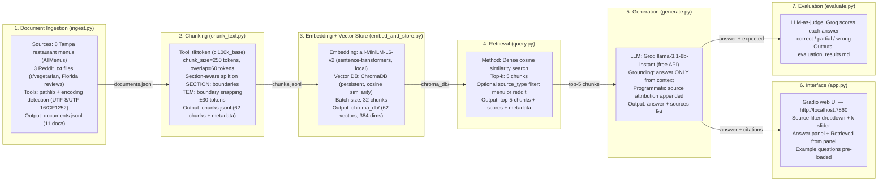

# Project 1 Planning: The Unofficial Guide

---

## Domain

This project focuses on vegetarian food discovery and decision-making in real-world restaurant environments, especially for international students and individuals with dietary restrictions in the Tampa, FL area.
 
This knowledge is valuable because restaurant menus are often unstructured, inconsistent, and lack clear labeling of ingredients. Hidden non-vegetarian components (such as fish sauce, gelatin, or broth) make it difficult to reliably identify safe meal options. Most relevant information is scattered across menus and community discussions, making it hard to access in one unified system.
 
This domain is ideal for a RAG system because it requires combining structured data (menus) with unstructured human opinions (Reddit discussions) to generate personalized and trustworthy recommendations.
 
---

## Documents

<!-- List your specific sources: URLs, subreddit names, forum threads, or file descriptions.
     Aim for at least 10 sources that together cover different subtopics or perspectives within your domain. -->

| # | Source | Description | Location |
|---|--------|-------------|----------|
| 1 | Chipotle (Tampa) | Menu items and descriptions | `data/raw/chipotle_restaurant.txt` |
| 2 | Maya's Restaurant | Mexican restaurant menu | `data/raw/mayas_restaurant.txt` |
| 3 | Mayuri Restaurant | Indian restaurant menu | `data/raw/mayuri_restaurant.txt` |
| 4 | Mirch Masala | Indian restaurant menu (largest file, 8.6k chars) | `data/raw/mirch_masala.txt` |
| 5 | Moe's SW Grill | Tex-Mex restaurant menu | `data/raw/moes_sw_restaurant.txt` |
| 6 | Shalimar Indian Cuisine | Indian restaurant menu | `data/raw/shalimar_restaurant.txt` |
| 7 | Taj Indian Cuisine | Indian restaurant menu | `data/raw/taj_restaurant.txt` |
| 8 | Tunduree Restaurant | Indian restaurant menu | `data/raw/tunduree_restaurant.txt` |
| 9 | Reddit r/vegetarian | Hidden animal ingredients guide | `data/clean/reddit_nveg.txt` |
| 10 | Reddit (Florida travel) | Vegetarian experiences in Florida restaurants | `data/clean/reddit_veg_experiences.txt` |
| 11 | Reddit (reviews) | Vegetarian restaurant reviews | `data/clean/reddit_veg_reviews.txt` |

**Note on planned vs. actual sources:** The original plan included Uber Eats, Grubhub, Yelp, USDA FoodData Central, Edamam API, Google Places API, and USF Dining. These were not ingested in this version. Evaluation questions Q1 (USF protein dishes), Q3 (Yelp reviews), and Q4 (calorie breakdowns) cannot be answered from current data — the system correctly responds "I don't have enough information" for these queries.

---

**Chunk size:** 250 tokens  
**Overlap:** 60 tokens
 
**Original spec:** 300–450 tokens, 60–100 overlap  
**Why reduced:** At 400 tokens, the 11-document dataset produced only 41 chunks — below the 50-chunk minimum needed for precise retrieval. Reducing to 250 tokens yields 62 chunks (within the 50–2,000 target range).
 
**Additional implementation decisions:**
- Menu files are pre-split on `SECTION:` boundaries before the sliding window is applied, so items from different menu sections are not merged mid-chunk
- Small trailing sections (under 40 tokens) are merged into the previous section rather than emitted as standalone fragments
- Boundary snapping: chunk endpoints are nudged to the nearest `ITEM:` line (±30 tokens) to avoid cutting mid-description
- `tiktoken` with `cl100k_base` encoding is used for token counting — the same tokenizer used by the embedding model, ensuring counts match at embed time
**Overlap rationale:** 60-token overlap ensures that ingredient warnings or dish descriptions split across a boundary appear in both adjacent chunks, so retrieval doesn't miss safety-critical content.
 
---
 
## Retrieval Approach
 
**Embedding model:** `all-MiniLM-L6-v2` (sentence-transformers, runs locally)
 
**Original plan:** `text-embedding-004` (Google)  
**Why changed:** `text-embedding-004` requires a Google API key, has rate limits, and adds ~50–100ms network latency per call — unsuitable for a development loop where chunks are re-embedded repeatedly. `all-MiniLM-L6-v2` runs fully locally with no API key, no cost, and embeds all 62 chunks in under 2 seconds on CPU. It produces 384-dimensional vectors with strong semantic accuracy on short food text.
 
**In a real production deployment**, `text-embedding-004` or `text-embedding-3-large` would be preferred for multilingual support (many international students query in their native language) and longer context windows.
 
**Vector store:** ChromaDB (persistent, stored at `data/processed/chroma_db/`)  
**Similarity metric:** Cosine similarity  
**Top-k:** 5 chunks per query
 
**Source-type filtering:** `retrieve()` accepts an optional `source_type` parameter (`"menu"` or `"reddit"`). This reduces retrieval drift — queries about ingredient warnings are filtered to Reddit chunks; queries about specific restaurant dishes are filtered to menu chunks. Without filtering, the generic "vegetarian food" signal causes unrelated menu chunks to rank above more relevant Reddit content.
 

## Evaluation Plan
 
| # | Question | Expected Answer | Status |
|---|----------|-----------------|--------|
| 1 | What vegetarian dishes are available at USF dining halls this week that have over 20g of protein? | List of high-protein plant-based dishes from USF menus with protein values | ❌ No USF/nutrition data ingested |
| 2 | Does the Tom Yum soup at Thai restaurants near me typically contain fish sauce or shrimp paste? | Yes — fish sauce and shrimp paste; suggest asking for vegan modification | ✅ Answered from Reddit r/vegetarian |
| 3 | Which Indian restaurants near USF have the most positive vegetarian reviews on Yelp? | Ranked list of 2–4 Indian restaurants with Yelp review sentiment | ❌ No Yelp data ingested |
| 4 | What is the calorie and macro breakdown of a vegetarian burrito bowl from Chipotle? | ~700–900 cal, protein ~25g, fat ~30g, carbs ~85g from USDA/Edamam | ❌ No nutrition data ingested |
| 5 | Are there any hidden non-vegetarian ingredients I should watch out for when ordering pasta at Italian restaurants? | Anchovies in Caesar dressing, meat broth in risotto, lard in pasta dough | ✅ Answered from Reddit r/vegetarian |
 
---
 
## Anticipated Challenges
 
**1. Hidden ingredient detection across inconsistent source quality**
 
Menu listings on AllMenus only show dish names and brief descriptions — they don't include full ingredient lists. This means the system may retrieve a "vegetarian" chunk that omits a warning about anchovies in a sauce. Reddit posts are more reliable for surfacing these warnings.
 
**Implemented mitigation:** Chunks are tagged by `source_type` (menu vs. reddit). The `retrieve()` function accepts a `source_type` filter so the LLM prompt can be populated with the right kind of content per query type. The generation prompt instructs the LLM to explicitly flag when ingredient certainty is low.
 
**2. Retrieval drift on broad or ambiguous queries**
 
At 62 chunks across 11 small documents, "vegetarian food" and "restaurant" appear in nearly every chunk — broad queries match too many chunks at similar scores (0.55–0.67), making ranking unreliable.
 
**Implemented mitigation:** `source_type` filtering, low temperature (0.2), and k=5 (not higher) limit context dilution. For future improvement: hybrid BM25 + dense retrieval would help keyword-sensitive queries like specific ingredient names.
 
---
 

## Anticipated Challenges
 
**1. Hidden ingredient detection across inconsistent source quality**
 
Menu listings on AllMenus only show dish names and brief descriptions — they don't include full ingredient lists. This means the system may retrieve a "vegetarian" chunk that omits a warning about anchovies in a sauce. Reddit posts are more reliable for surfacing these warnings.
 
**Implemented mitigation:** Chunks are tagged by `source_type` (menu vs. reddit). The `retrieve()` function accepts a `source_type` filter so the LLM prompt can be populated with the right kind of content per query type. The generation prompt instructs the LLM to explicitly flag when ingredient certainty is low.
 
**2. Retrieval drift on broad or ambiguous queries**
 
At 62 chunks across 11 small documents, "vegetarian food" and "restaurant" appear in nearly every chunk — broad queries match too many chunks at similar scores (0.55–0.67), making ranking unreliable.
 
**Implemented mitigation:** `source_type` filtering, low temperature (0.2), and k=5 (not higher) limit context dilution. For future improvement: hybrid BM25 + dense retrieval would help keyword-sensitive queries like specific ingredient names.
 
---
 
## AI Tool Plan
 
### 1. Ingestion (`ingest.py`)
**Tool:** Claude (claude.ai)  
**What it does:** Loads `.txt` files from `data/raw/` (menus) and `data/clean/` (Reddit), handles Windows encoding issues (UTF-8, UTF-16, CP1252), cleans text, infers cuisine type, outputs `data/processed/documents.jsonl`
 
### 2. Chunking (`chunk_text.py`)
**Tool:** Claude (claude.ai)  
**What it does:** Loads `documents.jsonl`, splits menus by `SECTION:` boundaries first, applies 250-token sliding window with 60-token overlap using `tiktoken`, snaps boundaries to `ITEM:` lines, prepends metadata header to each chunk, outputs `data/processed/chunks.jsonl`
 
### 3. Inspection (`pipeline_check.py`)
**Tool:** Claude (claude.ai)  
**What it does:** Milestone 3 checkpoint — prints one cleaned document per type, 5 representative chunks with quality verdicts, chunk count with range validation (50–2,000 target)
 
### 4. Embedding + Vector Store (`embed_and_store.py`)
**Tool:** Claude (claude.ai)  
**What it does:** Loads chunks, embeds with `all-MiniLM-L6-v2` in batches of 32, stores in ChromaDB with cosine similarity, persists to `data/processed/chroma_db/`
 
### 5. Retrieval (`query.py`)
**Tool:** Claude (claude.ai)  
**What it does:** `retrieve(query, k=5, source_type=None)` — embeds query, queries ChromaDB, returns top-k chunks with scores and metadata. `source_type` filter reduces drift.
 
### 6. Generation (`generate.py`)
**Tool:** Claude (claude.ai)  
**What it does:** Builds grounded prompt with retrieved context, calls Groq `llama-3.1-8b-instant`, appends programmatic source attribution, returns `answer`, `chunks`, `prompt`, `sources`
 
### 7. Interface (`app.py`)
**Tool:** Claude (claude.ai)  
**What it does:** Gradio web UI at `http://localhost:7860` — question input, source filter dropdown (All / Menus only / Reddit only), k slider, answer panel, sources panel, pre-loaded example questions
 

---
 
### 5. Evaluation (`evaluate.py`)
 
**Tool:** Claude (claude.ai)  
**What it does:** Runs all 5 evaluation plan questions through the full RAG pipeline, uses Groq `llama-3.1-8b-instant` as LLM judge to score each response as correct/partial/wrong with a reason. Outputs `data/processed/evaluation_results.md` with a full markdown report. Q1, Q3, Q4 are scored as **correct** when the system says "I don't have enough information" — that is the right behavior given the data gaps.

---

## Architecture
 

 
---
 

---

**Milestone 3 — Ingestion and chunking:**

**Milestone 4 — Embedding and retrieval:**

**Milestone 5 — Generation and interface:**
